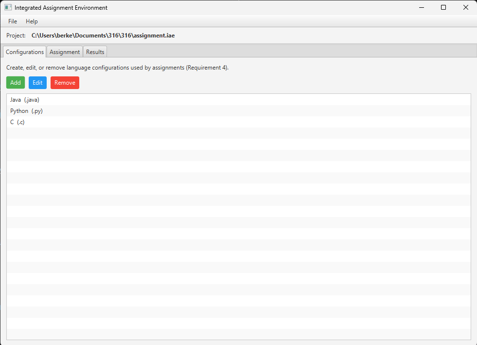
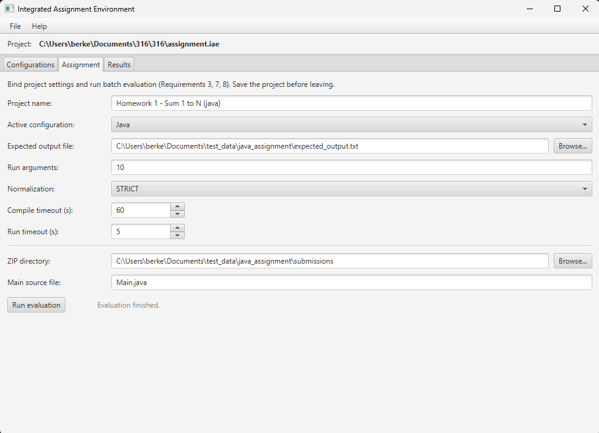
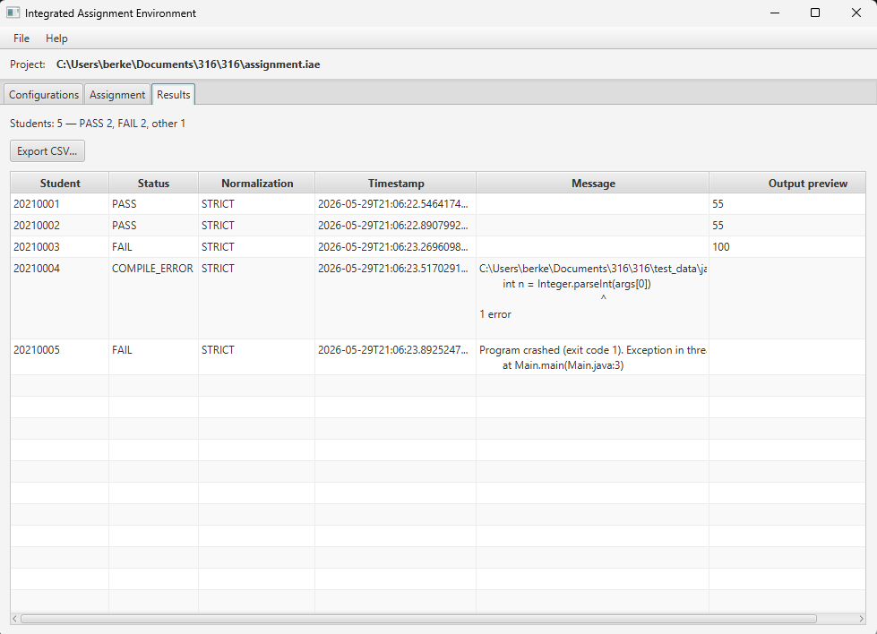

# IAE – Integrated Assignment Environment

A desktop app for instructors to automatically grade student programming assignments.

You give it:
- A folder full of student `.zip` files
- A `.txt` file with the correct expected output

It compiles and runs each student's code, compares the output, and shows you who passed and who failed — with a full diff for failures. Supports any language (C, Java, Python, Prolog, etc.)

---

## How it works (general)

1. You create a **project** (`.iae` file) — this stores everything
2. You add a **language configuration** — tells the app how to compile and run code for a specific language
3. You go to the **Assignment** tab, point it at your expected output file and student ZIP folder
4. You click **Run evaluation** — it processes every student automatically
5. You check the **Results** tab — see who passed, export to CSV if needed

---

## Screenshots

**Configurations tab**


**Assignment tab**


**Results tab**


---

## Examples

### Example 1 — Grading a C assignment

**Scenario:** Students submitted a program that takes no input and prints `Hello, World!`

**Step 1:** Create `expected_output.txt` with exactly:
```
Hello, World!
```

**Step 2:** Rename student submissions so each zip is named by student ID:
```
submissions/
  20210101001.zip   ← contains main.c
  20210101002.zip   ← contains main.c
  20210101003.zip   ← contains main.c
```

**Step 3:** Open the app, go to **File → New Project**, save it somewhere.

**Step 4:** In the **Configurations** tab, click **Add** and fill in:

| Field | Value |
|---|---|
| Language name | `C` |
| File extension | `.c` |
| Compiler path | `gcc` |
| Compile arguments | `-o {executable} {source}` |
| Run arguments | `{executable}` |

**Step 5:** Go to the **Assignment** tab and fill in:

| Field | Value |
|---|---|
| Active configuration | `C` |
| Expected output file | path to `expected_output.txt` |
| ZIP directory | path to `submissions/` folder |
| Main source file | `main.c` |
| Normalization | `TRIM_WHITESPACE` (safe default) |

**Step 6:** Click **Run evaluation** → check the **Results** tab.

---

### Example 2 — Grading a Java assignment

**Scenario:** Students submitted a Java program. The main file is `Main.java`.

**Language configuration:**

| Field | Value |
|---|---|
| Language name | `Java` |
| File extension | `.java` |
| Compiler path | `javac` |
| Compile arguments | `{source}` |
| Run arguments | `java -cp {workDir} {className}` |

**Assignment tab:**

| Field | Value |
|---|---|
| Main source file | `Main.java` |
| Normalization | `TRIM_WHITESPACE` |

Everything else is the same as Example 1. The `{className}` placeholder automatically becomes `Main` (the filename without extension), and `{workDir}` is the folder where the `.class` file lands.

---

### Example 3 — Grading a Python assignment

**Scenario:** Students submitted a Python script. No compilation needed.

**Language configuration:**

| Field | Value |
|---|---|
| Language name | `Python` |
| File extension | `.py` |
| Compiler path | *(leave empty)* |
| Compile arguments | *(leave empty)* |
| Run arguments | `py {source}` |

Set **Compiler path** to `python` (or `python3` depending on your system) and leave compile arguments empty if Python doesn't need a compile step — or set both compiler and run to use the interpreter directly.

---

## Submission ZIP format

Each ZIP must be named `<studentId>.zip` — the student ID is taken directly from the filename.

```
submissions/
  20210101001.zip
  20210101002.zip
```

The main source file (e.g. `main.c`) just needs to be somewhere inside the ZIP. Nested folders are fine.

---

## Result statuses

| Status | Meaning |
|---|---|
| PASS | Output matched expected |
| FAIL | Output didn't match — double-click to see the diff |
| COMPILE_ERROR | Code didn't compile — double-click to see compiler output |
| TIMEOUT | Program ran longer than the timeout you set |
| ERROR | Something unexpected went wrong |

---

## Normalization modes

| Mode | What it does |
|---|---|
| STRICT | Exact match, character for character |
| TRIM_WHITESPACE | Ignores leading/trailing spaces on each line |
| CASE_INSENSITIVE | TRIM_WHITESPACE + ignores uppercase/lowercase |

---

## Import / Export configurations

You can save your language configurations to a JSON file and load them in another project:
- **File → Export Configurations**
- **File → Import Configurations** (choose merge or replace existing)

---

## Build & run

Requires JDK 17. Gradle downloads the toolchain automatically.

```sh
./gradlew run
```
